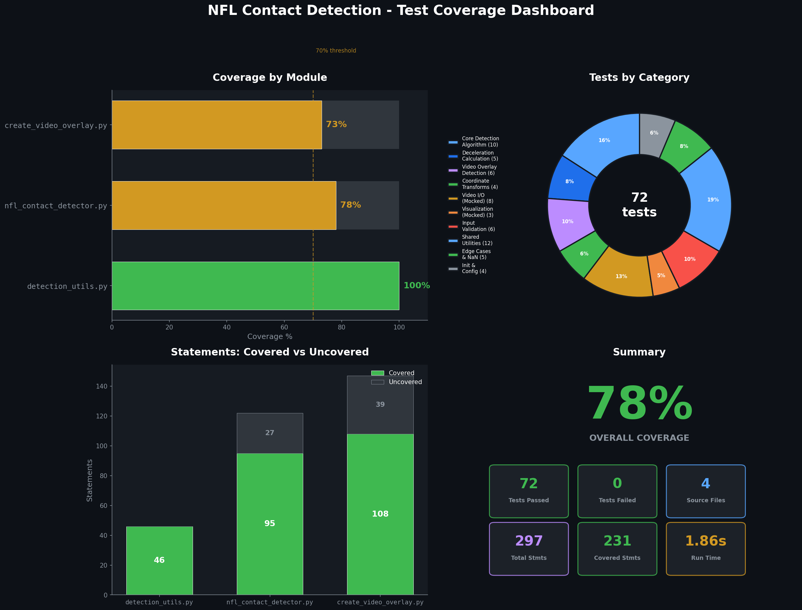

# NFL Player Contact Detection System


Automated player contact detection using NFL tracking sensor data. Identifies player-to-player collisions in real-time without video processing — built from domain experience as an NFL Film Review Analyst.

## What This Project Does

Detects when NFL players make contact during gameplay using helmet tracking chip data:

1. Analyze player positions (X, Y) from tracking sensors at 10Hz
2. Calculate deceleration as an impact signature
3. Flag contact when two players are **within 2 yards** AND **at least one is rapidly decelerating**

No video required — works with sensor data alone, enabling real-time analysis during live games.

## Detection Algorithm

```python
For each frame:
    For each pair of players:
        distance = euclidean_distance(player1, player2)
        decel = previous_speed - current_speed

        if distance < 2.0 yards AND (decel1 > 0.5 OR decel2 > 0.5):
            → Contact detected
```

- **Proximity alone isn't enough** — players can be close without contact
- **Deceleration signals impact** — sudden speed reduction indicates collision
- **Combined criteria reduce false positives** — both conditions must be met

## Results

### Sample Play: Game 58172, Play 3247

| Metric | Value |
|--------|-------|
| Tracking records analyzed | 8,756 |
| Players tracked | 22 |
| **Contact events detected** | **192** |
| Time steps with contacts | 61 |
| Peak simultaneous contacts | 6 |
| Avg contact distance | 1.11 yards |
| Avg impact deceleration | 0.71 yards/sec² |

Video overlay confirms detected contacts align with visible collisions — timing matches expected contact phases (snap, blocking, tackling) and locations cluster near the line of scrimmage.

**Strengths:**
- Real-time capable — no video processing lag
- Works in any lighting/weather — sensor-based
- Objective, quantifiable measurements
- Scalable to full games

**Limitations:**
- Cannot distinguish contact types (helmet-to-helmet vs body)
- Proximity threshold may miss glancing contacts

## Quick Start

```bash
git clone https://github.com/daylinhart/nfl-contact-detection.git
cd nfl-contact-detection
pip install -e ".[dev]"
```

### Usage

```python
from src.nfl_contact_detector import NFLContactDetector
import pandas as pd

tracking = pd.read_csv('player_tracking.csv')
detector = NFLContactDetector(distance_threshold=2.0, decel_threshold=0.5)

play_data = tracking[(tracking['gameKey'] == game) & (tracking['playID'] == play)]
contacts_df = detector.detect_contacts_in_play(play_data)

for _, contact in contacts_df.iterrows():
    print(f"Contact: {contact['player1']} - {contact['player2']}")
    print(f"  Distance: {contact['distance']:.2f} yds, Decel: {contact['max_decel']:.2f} yds/s²")
```

## Project Structure

```
nfl-contact-detection/
├── src/
│   ├── nfl_contact_detector.py       # Core detection algorithm
│   ├── create_video_overlay.py       # Video visualization (optional)
│   └── detection_utils.py            # Shared detection logic & constants
├── tests/                            # 72 tests, 78% coverage
├── .github/workflows/ci.yml          # CI pipeline (Python 3.8/3.10/3.12)
├── pyproject.toml                    # Build config & tool settings
└── Makefile                          # Dev task runner
```

## Testing



```bash
make test          # Run tests
make coverage      # Run with coverage report
make lint          # Run ruff linter
```

| Module | Coverage | Tests |
|--------|----------|-------|
| `detection_utils.py` | 100% | 19 |
| `nfl_contact_detector.py` | 78% | 25 |
| `create_video_overlay.py` | 73% | 28 |

## Tech Stack

Python 3.8+ · Pandas · NumPy · OpenCV · Matplotlib · pytest · GitHub Actions

## Author

**Daylin Hart** — AI/ML Engineer | Sports Analytics

[LinkedIn](https://linkedin.com/in/daylin-hart) · [GitHub](https://github.com/daylinhart) · daylin.hart@gmail.com

## License

MIT — See [LICENSE](LICENSE)
