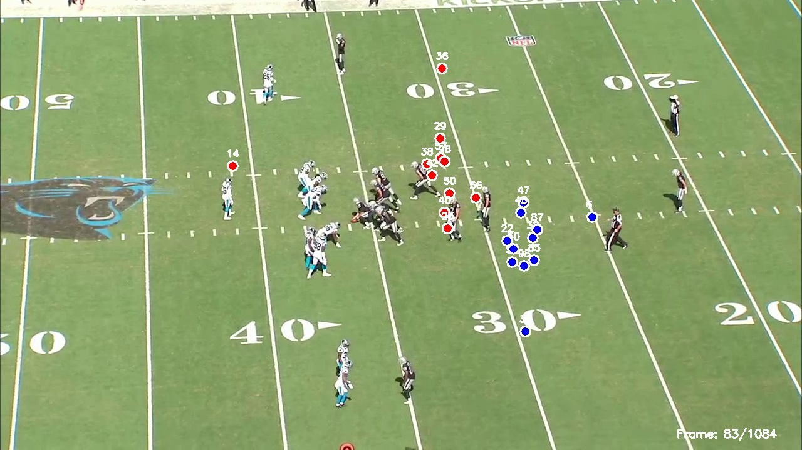

# NFL Player Contact Detection System



Automated player contact detection system analyzing NFL tracking data to identify player-to-player collisions in real-time. Built to demonstrate how data science can complement computer vision approaches for comprehensive player safety monitoring.

## 🎯 Project Motivation

During my work as an NFL Film Review Analyst, I annotated ~1,000 game images to create ground truth training data for computer vision systems that identify players and detect contacts. This experience revealed an important insight: **computer vision and tracking data are complementary approaches to player safety analysis.**

This project explores the tracking data side of the equation - demonstrating how position and velocity sensors can detect contact events without video processing, providing real-time monitoring capabilities that complement CV-based post-game analysis.

## 📊 What This Project Does

**Core Problem:** Detect when NFL players make contact during live gameplay using only tracking sensor data.

**Approach:**

1. Analyze player position data (X, Y coordinates) from helmet tracking chips
2. Calculate velocity changes to detect deceleration (impact signature)
3. Flag contact when two players are within 2 yards AND at least one is rapidly decelerating

**Key Innovation:** No video processing required for detection - works with sensor data alone, enabling real-time analysis during live games.

## 🔬 Technical Implementation

### Phase 1: Contact Detection Algorithm

**Input Data:**

- Player tracking data at 10Hz frequency
- Position coordinates (x, y) for all 22 players
- Velocity and acceleration vectors
- Team assignments

**Detection Logic:**

```python
For each frame:
    For each pair of players:
        distance = calculate_distance(player1, player2)
        decel1 = previous_speed - current_speed
        decel2 = previous_speed - current_speed

        if distance < 2.0 yards AND (decel1 > 0.5 OR decel2 > 0.5):
            → Contact detected
```

**Why This Works:**

- **Proximity alone isn't enough** - players can be close without contact
- **Deceleration signals impact** - sudden speed reduction indicates collision
- **Combined criteria reduce false positives** - both conditions must be met

### Phase 2: Video Overlay System (Demonstration)

To prove the detection algorithm works, I built a video processing pipeline that:

- Synchronizes tracking data timestamps with video frames
- Overlays player positions as colored circles (red=home, blue=away)
- Labels each player with jersey number
- Highlights detected contacts with yellow stars
- Displays real-time "CONTACT DETECTED" alerts

**This video overlay is NOT required for detection** - it's purely a visualization tool to validate that the tracking-based algorithm accurately identifies real contact events visible in the video.

## 📈 Results & Analysis

### Sample Play: Game 58172, Play 3247

**Dataset:**

- 8,756 tracking records analyzed
- 398 time steps (frames) at 10Hz
- 22 players tracked simultaneously
- ~18 second play duration

**Detection Results:**

- **192 contact events detected**
- 61 distinct time steps contained contacts
- 166 video frames showed contact alerts (15% of play)
- Peak: 6 simultaneous contacts in single frame
- Average contact distance: 1.11 yards
- Average impact deceleration: 0.71 yards/sec²

**Validation:**

- Video overlay confirms detected contacts align with visible collisions
- Timing matches expected contact phases (snap, blocking, tackling)
- Contact locations cluster near line of scrimmage and tackle points

### Detection Performance Characteristics

**Strengths:**

- ✅ Real-time capable (processes instantly, no video lag)
- ✅ Works in any lighting/weather (sensor-based, not camera-dependent)
- ✅ Objective measurements (distance and deceleration are quantifiable)
- ✅ Scalable (can analyze entire games with no performance degradation)

**Limitations:**

- ⚠️ Cannot distinguish contact types (helmet-to-helmet vs body contact)
- ⚠️ Requires sensor data (not applicable to historical footage without tracking)
- ⚠️ Proximity threshold may miss glancing contacts
- ⚠️ May flag incidental close proximity as contact if player trips/falls

## 🎓 Key Learnings & Insights

### 1. Tracking Data Complements Computer Vision

**From NFL Film Review Work:**

- CV excels at: Identifying players, classifying contact types, analyzing form
- CV struggles with: Real-time processing, occlusion, camera angle dependencies

**From This Project:**

- Tracking data excels at: Real-time detection, precise positioning, weather independence
- Tracking data struggles with: Contact type classification, understanding context

**Optimal Approach:** Combine both

- Use tracking data for real-time alerts during live games
- Use computer vision for post-game detailed analysis and contact classification
- Cross-validate between systems for highest confidence detections

### 2. Tunable Thresholds Enable Different Use Cases

**Conservative Settings** (2.0 yards, 0.5 yards/sec²):

- Fewer false positives
- Catches moderate-to-severe impacts
- Suitable for medical review flagging

**Sensitive Settings** (2.5 yards, 0.3 yards/sec²):

- More comprehensive detection
- Includes glancing contacts
- Better for complete game analysis

**Aggressive Settings** (1.5 yards, 1.0 yards/sec²):

- Only severe impacts
- Minimal false positives
- Ideal for helmet-to-helmet targeting

### 3. Production Implementation Considerations

**For Live Game Use:**

- Stream tracking data at 10Hz
- Process detection in <100ms per frame
- Alert medical staff immediately for high-impact contacts
- Log all detections for post-game review

**For Post-Game Analysis:**

- Batch process all plays
- Generate contact frequency reports by player
- Correlate with injury outcomes
- Track cumulative impact load across season

## 🔄 How This Connects to My NFL Work

**At NFL (Film Review Annotation):**

- Validated CV model outputs for player identification
- Created ground truth data for training ML systems
- Ensured data quality for ~1,000 annotated images
- Worked with production ML pipelines

**In This Project:**

- Applied domain knowledge to player safety problem
- Demonstrated alternative data-driven approach (tracking vs CV)
- Built system that could complement CV workflows
- Showed understanding of production ML considerations

**Combined Value:**

- **CV side:** Model training, output validation, data quality
- **Tracking side:** Real-time detection, quantitative metrics, scalability
- **Integration:** Both systems working together for comprehensive monitoring

## 💡 Real-World Applications

### Player Safety & Medical

**Immediate Alert System:**

- Flag high-impact contacts for medical review
- Track cumulative contact load per player
- Monitor players returning from injury
- Identify high-risk plays for protocol review

**Longitudinal Analysis:**

- Correlate contact frequency with injury outcomes
- Identify positions with highest impact exposure
- Optimize substitution patterns based on contact load
- Season-long player safety profiles

### Rule Enforcement

**Automated Review:**

- Pre-flag potential targeting penalties
- Identify helmet-to-helmet candidates
- Track unnecessary roughness patterns
- Provide objective data for official review

**Pattern Analysis:**

- Team contact tendencies
- Player discipline tracking
- Late hit detection
- Contact after whistle identification

### Performance Analytics

**Coaching Insights:**

- Offensive line contact engagement rates
- Defensive pressure patterns
- Tackle effectiveness metrics
- Contact avoidance by skill players

**Strategic Planning:**

- Identify physical mismatches
- Plan substitutions around contact exposure
- Design plays minimizing high-risk contact
- Scout opponent contact patterns

## 🚀 Quick Start

### Installation

```bash
git clone https://github.com/daylinhart/nfl-contact-detection.git
cd nfl-contact-detection
pip install -r requirements.txt
```

### Basic Usage (Tracking Data Only)

```python
from src.nfl_contact_detector import detect_contacts_in_frame
import pandas as pd

# Load your tracking data
tracking = pd.read_csv('player_tracking.csv')

# Detect contacts for a specific frame
frame_data = tracking[tracking['time'] == selected_time]
contacts = detect_contacts_in_frame(
    frame_data,
    distance_threshold=2.0,
    decel_threshold=0.5
)

# View results
for contact in contacts:
    print(f"Contact between {contact['player1']} and {contact['player2']}")
    print(f"  Distance: {contact['distance']:.2f} yards")
    print(f"  Deceleration: {contact['max_decel']:.2f} yards/sec²")
```

### Video Overlay (Optional - Requires Video)

```python
from src.create_video_overlay import process_video

# Add visual overlay to video
process_video(
    video_path='game_footage.mp4',
    tracking_path='player_tracking.csv',
    output_path='annotated_video.mp4'
)
```

## 📁 Project Structure

```
nfl-contact-detection/
├── README.md                         # This file
├── requirements.txt                  # Dependencies
├── LICENSE                          # MIT License
├── .gitignore                       # Git ignore rules
│
├── src/
│   ├── nfl_contact_detector.py      # Core detection algorithm
│   └── create_video_overlay.py      # Video visualization (optional)
│
├── visualizations/
│   ├── nfl_contact_detection_demo.png      # Field view with contacts
│   └── nfl_video_overlay_thumbnail.jpg     # Video overlay sample
│
└── demo/
    └── .gitkeep                     # Placeholder for demo videos
```

## 🔮 Future Enhancements

**Phase 1: Enhanced Detection**

- [ ] Player orientation analysis for head-on vs side collisions
- [ ] Acceleration jerk detection (rate of deceleration change)
- [ ] Integration with actual helmet sensor impact data
- [ ] Multi-tier severity classification (glancing, moderate, severe)

**Phase 2: Machine Learning Integration**

- [ ] Train classifier for contact type (helmet-to-helmet, body, etc.)
- [ ] Predict injury risk scores based on impact characteristics
- [ ] Ensemble with computer vision for comprehensive detection
- [ ] Historical outcome correlation for risk modeling

**Phase 3: Production System**

- [ ] Real-time streaming pipeline for live game analysis
- [ ] Dashboard for medical staff and officials
- [ ] Automated alert system for high-risk contacts
- [ ] API for integration with team analytics platforms

**Phase 4: Extended Analytics**

- [ ] Season-long player contact exposure profiles
- [ ] Position-specific contact benchmarking
- [ ] Team-level physicality metrics
- [ ] Optimal load management recommendations

## 🛠️ Tech Stack

- **Language:** Python 3.8+
- **Data Processing:** Pandas (tracking data manipulation), NumPy (distance calculations)
- **Video Processing:** OpenCV (frame-by-frame overlay, optional)
- **Visualization:** Matplotlib (field diagrams, contact plots)
- **Data Source:** NFL Next Gen Stats tracking sensors (10Hz)

## 📊 Dataset Information

**Tracking Data Format:**

| Column         | Description                 | Example     |
| -------------- | --------------------------- | ----------- |
| `game_key`     | Unique game identifier      | 58172       |
| `play_id`      | Play within game            | 3247        |
| `step`         | Time step (10Hz)            | -272 to 398 |
| `player`       | Player identifier           | H57         |
| `x_position`   | Field position X (yards)    | 64.28       |
| `y_position`   | Field position Y (yards)    | 11.29       |
| `speed`        | Velocity (yards/sec)        | 4.82        |
| `acceleration` | Rate of change (yards/sec²) | 3.13        |
| `team`         | home/away                   | home        |

**Note:** Full dataset not included (NFL proprietary data). Sample demonstrates methodology using publicly available NFL Big Data Bowl competition data.

## 📝 License

MIT License - See [LICENSE](LICENSE) file for details

## 👤 Author

**Daylin Hart**  
AI/ML Engineer | Sports Analytics

- **LinkedIn:** [linkedin.com/in/daylin-hart](https://linkedin.com/in/daylin-hart)
- **GitHub:** [github.com/daylinhart](https://github.com/daylinhart)
- **Email:** daylin.hart@gmail.com

**Related Work:**

- **NFL Film Review Analyst** - Computer vision annotation & data quality
- **NBA Game Prediction** - ML engineering with neural networks from scratch
- **NBA Shot Validator** - Data validation pipeline development

## 🙏 Acknowledgments

Built as a portfolio project demonstrating how tracking data can complement computer vision for player safety analysis. Directly inspired by my work with NFL film review annotation, where I saw firsthand how CV and data science approaches can work together.

Special thanks to the NFL Big Data Bowl for providing access to tracking data that made this analysis possible.

---

**⭐ If you found this project helpful, please consider starring the repository!**

**Interested in sports analytics or player safety tech? Let's connect!**
